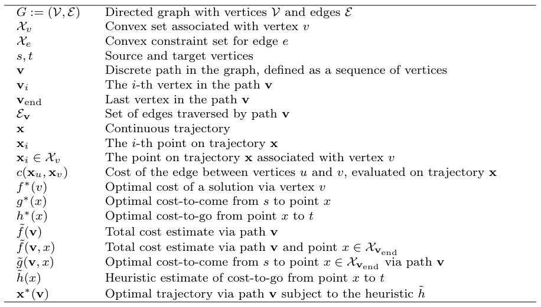
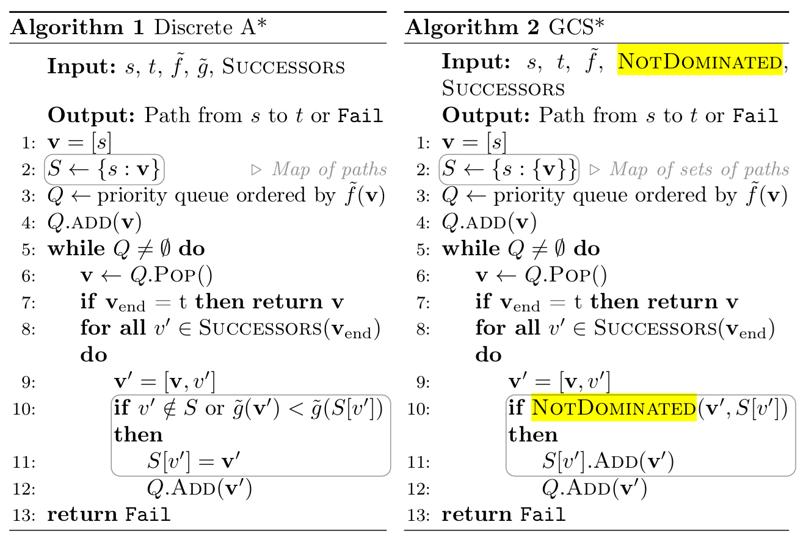
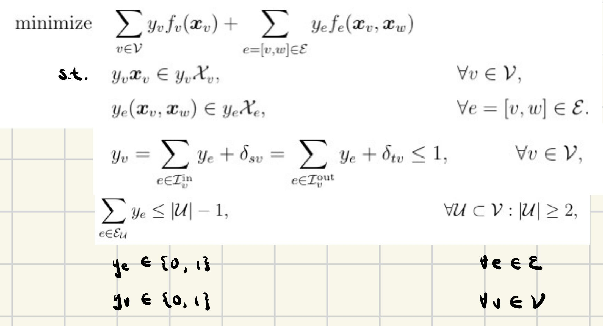
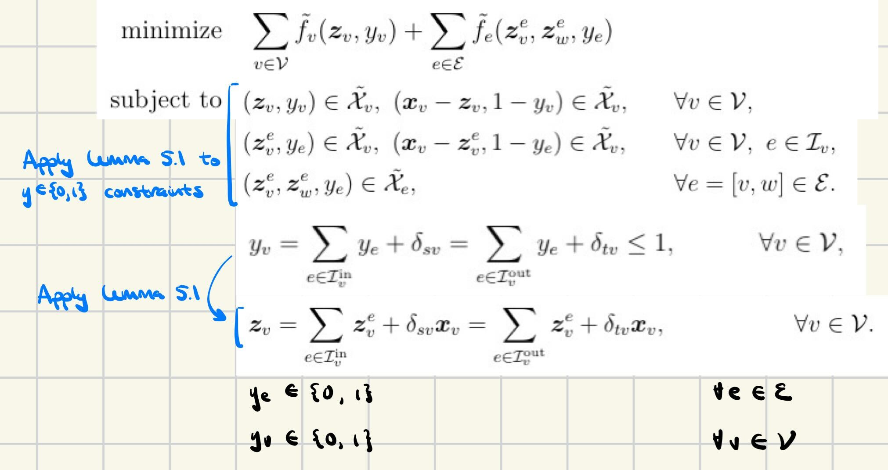

## (GCS*:) [GCS*: Forward Heuristic Search on Implicit Graphs of Convex Sets](https://arxiv.org/pdf/2407.08848)
### Terminology
- "implicit graph": not fully defined/stored in memory; instead defined via a source vertex and a successor operator that acts on a vertex and returns all outgoing edges.
- in edge `(u,v)`, `v` is a "successor of `u`

 

- NOTE: $\mathbf{v}$ refers to a "path", which is just a sequence of vertices regardless of exact points $x$ within each vertex
- $f^*(v) = g^*(x) + h^*(x)$ denotes that $x$ is on the optimal path through $v$ 

### Key problem and insight:
- A* relies on OSPP (optimal sub-path property): all subpaths of an optimal path from $s$ to $t$ are also optimal. A* prunes a path when it sees that its cost-to-come is "dominated by" (i.e. greater than) the cost-to-come of another path between the same vertices.
   - Note: A* (and similarly, Dijkstra's) don't explicitly do any pruning of suboptimal subpaths, but the pruning is inherent in the PQ and `visited` set: each time a vertex `v` is reached, a `(d, v)` entry is added to the PQ. Then, later, the `(d, v)` pair corresponding to the shortest path to `v` will be the first among all `(d,v)` pairs to be popped from the PQ and explored (because the PQ is ordered by $($`d`$+ \tilde{h}($`v`$))$; note that $\tilde{h}($`v`$)$ is the same regardless of the path to `v`), after which `v` will added to the `visited` set, preventing any longer paths to `v` from ever being explored.
- OSPP doesn't hold for GCS -- shortest path from $s$ to $v$/$x_v \in \mathcal{X}_v$ goes to closest point in $\mathcal{X}_v$, but optimal path from $s$ to $t$ might select different point in $\mathcal{X}_v$
- Optimal Sub-Trajectory property -- this does hold for GCS: for optimal traj from $s$ to $t$, any sub-trajectories (between 2 specific points) are optimal.
   - One more condition required for this to be true: GCS allowed to revisit vertices (i.e. technically finds a shortest *walk* instead of shortest *path*). Why: the reason Optimal Sub-Traj. Prop. holds is because the optimal traj. to a pt. is idpt. of the optimal way to continue from that pt, only *if* the vertex that pt. belongs to can be visited again in the future.
      - Note: in traditional graphs, it's never optimal to revisit vertices, but in GCS, you can have weird cost functions that do make it optimal.
- Completeness property -- if we used A*'s pruning strategy, we might fail to find an solution when there is one; a shorter subpath from $s$ to $v$ might not lead to a feasible path to $t$, and would prune a longer, feasible path from $s$ to $v$.

- Main idea:
   1. GCS* doesn't prune a sub-path to $v$ so long as that path is cheaper to reach *any* point in $\mathcal{X}_v$ (retain optimality)
   2. GCS* doesn't prunes a sub-path so long as it reaches a new, unreached point (retain completeness)

### Domination Checks
- a func. that determines whether a candidate path should be pruned or added to PQ
- $\text{ReachesCheaper}$ -- optimal, complete
   - Return True (i.e. don't prune) if there exists $x \in \mathcal{X}_{\mathbf{v}_{\text{end}}}$ such that candidate path $\mathbf{v}'$ is cheaper than any other known path to $x$:

$$\text{ReachesCheaper}(\mathbf{v}', S[\mathbf{v}_{\text{end}}]) \; := \; \exists x \in \mathcal{X}_{\mathbf{v}_{\text{end}}} \\
\text{s.t.} \quad \tilde{g}(\mathbf{v}', x) < \tilde{g}(\mathbf{v}, x), \quad \forall \mathbf{v} \in S[\mathbf{v}_{\text{end}}].$$
   
- $\text{ReachesNew}$ -- non-optimal, complete, faster than ReachesCheaper
   - Return True (i.e. don't prune) if there exists $x \in \mathcal{X}_{\mathbf{v}_{\text{end}}}$ such that candidate path $\mathbf{v}'$ is the only known to $x$:

$$\text{ReachesNew}(\mathbf{v}', S[\mathbf{v}_{\text{end}}]) \; := \; \exists x \in \mathcal{X}_{\mathbf{v}_{\text{end}}} \\
\text{s.t.} \quad \tilde{g}(\mathbf{v}', x) < \infty \quad \text{AND} \quad (\tilde{g}(\mathbf{v}, x) = \infty \; \; \forall \mathbf{v} \in S[\mathbf{v}_{\text{end}}]).$$

#### Implementation
Sampling-based (probabilistically complete and optimal): sample $x \in \mathcal{X}_{\mathbf{v}_\text{end}}$; if it satisfies both $\text{ReachesCheaper}$ and $\text{ReachesNew}$, then do not prune.

Set containment-based (complete and optimal): 
- For a path $\mathbf{v}$: trajectories must reside in $\mathcal{P}_\mathbf{v}$
- ...TODO

### Algorithm
- $S$: map from $v$ to set of paths to $v$
   - note that A* effectively maintains map from vertex to single path (via `parent` dict.)
- Select either $\text{ReachesNew}$ (for a faster check that guarantees completeness) or $\text{ReachesCheaper}$ (for optimal and complete) and call it $\text{NotDominated}$
   - $\text{NotDominated}$ accepts 2 parameters: a new path to $v'$, and a list of existing paths to $v'$.

 

**Importantly**: the way the PQ is ordered is by: 

$$\tilde{f}(\mathbf{v}) := \tilde{g}(\mathbf{v}, [\mathbf{x}^*(\mathbf{v})]_\text{end}) + \tilde{h}([\mathbf{x}^*(\mathbf{v})]_\text{end})$$

$\tilde{f}(\mathbf{v})$ is the lowest possible estimated cost for any path from $s$ to $t$ going through subpath $\mathbf{v}$.

In simple terms, $\tilde{f}(\mathbf{v})$ is the sum of cost-to-come of optimal trajectory $\mathbf{x}^*(\mathbf{v})$ through path $\mathbf{v}$ (ending at point $[\mathbf{x}^*(\mathbf{v})]_\text{end}$), and cost-to-go of optimal trajectory $\mathbf{x}^*(\mathbf{v})$ through path $\mathbf{v}$.

$\tilde{f}(\mathbf{v})$ is computed exactly by solving the $\text{ConvexRestriction}$ of the GCS with $\mathbf{v}$ fixed, and with an added convex cost function $\tilde{h}$. 

**Algorithm intuitive explanation:**
1. Initialize path to $[s]$
2. Pop current path $\mathbf{v}$ off PQ
3. For each vertex $v'$ that's a successor to the last vertex in $\mathbf{v}$:

   a. Build new path $\mathbf{v}'$ that appends $\mathbf{v} + v'$. If $\mathbf{v}'$ is $\text{NotDominated}$ by existing paths to $v'$ (which exist in $S[v']$), add it to PQ and save it in $S$

### Algorithm Properties and Invariants
If the heuristic is admissable: 
- paths popped off the queue have monotonically increasing cost
- no path that is more expensive than the true optimal path should ever be popped off the queue

If the heuristic is consistent:
- ~~The algorithm will only pop a path that ends at a particular vertex off the queue once~~
- Consistency doesn't apply in the case of GCS*; there can be other paths popped off the queue that end at the same vertex

**Note**: Definition of consistent heursitic:

$$ h(\mathbf{v}) \leq g(\mathbf{v}') - g(\mathbf{v}) + h(\mathbf{v}') $$

$\mathbf{v}'$ must be a successor of $\mathbf{v}$ in the *search tree*: i.e. $\mathbf{v}'$ contains $\mathbf{v}$ plus one successor vertex.

Intuition:
1. Re-arrange the equation: $h(v) + g(v) \leq h(v') + g(v')$: the estimated cost $f$ increases (weakly) as a the algorithm searches deeper and deeper into the search tree. This implies that the first time you pop a path to a vertex $v$ off the Q, that path has the optimal $g(v)$ and $f(v)$; you won't find a cheaper path by going deeper into the search tree.
2. For A*, this implies optimal efficiency; once a path to a vertex $v$ is popped off the Q/"expanded", there's no need to ever "expand" another path to $v$ again. Each vertex only need be expanded once.

 
 

## (GCS (Tobia's Thesis, Ch. 5):) [Graphs of Convex Sets with Applications to Optimal Control and Motion Planning](https://dspace.mit.edu/bitstream/handle/1721.1/156598/marcucci-tobiam-phd-eecs-2024-thesis.pdf?sequence=1&isAllowed=y) - 11/4/2024
Background: general graph optimization problems

 

 - Variables are the subgraph $H$ (i.e. which edges/nodes); $\mathcal{H} = $ set of valid subgraphs (i.e. a path from $s$ to $t$, or a spanning tree, etc. depending on the problem being solved)

GCS Formulation
- Each node = cvx program
- Each edge (v,w) = cvx cost and constraints, coupling programs v, w

 

- Two aspects of the problem:
   - if $H$ is fixed, it's a simple cvx opt.
   - if variables $x_v$ are fixed, it's a simple graph opt.
   - A simple local solving idea could be to iterate between cvx opt. and graph opt.; but we will try to do better.

GCS MINCP (Mixed Integer Non-Convex Program) Formulation

 

- $\mathcal{y}= $ "incidence vector" -- set of binary variables describing whether to include each vertex/edge
- $\mathcal{Y} \subseteq [0,1]^{\mathcal{V} \cup \mathcal{E}} = $ polytope of allowed subgraphs, constraining $\mathcal{y}$
- Notice: cost + last 2 constraints are non-cvx (bilinearity btwn $x$ and $y$).
   - The last 2 constraints apply if a corresponding node/edge are included in the solution ($\mathcal{y}$ value=1)
   - Cost function only adds cost of nodes/edges that are included in the solution ($\mathcal{y}$ value=1)

- We want to make the program cvx
   - Define auxiliary variables $z := y x$ for each vtx/edge
   - Define modified cost functions/constraint sets that operate on $z$
      - $\tilde{\mathcal{X}}_v \in \mathbb{R}^{n+1} = \{(z_v, y_v)$ | $z_v = x_v y_v$ for some $x_v \in \mathcal{X}_v,$ appended with $y_v \}$
      - $\tilde{\mathcal{X}}_e  \in \mathbb{R}^{2n+1} = \{(z_v^e, z_w^e, y_e)$ | $z_v^e = y_e x_v, z_w^e = y_e x_w$ for $(x_v, x_w) \in \mathcal{X}_e,$ appended with $y_e \}$

      - These are called "Homogenezations" of the sets $\mathcal{X}_v, \mathcal{X}_e$; embed them into a higher dimension where scaling by $y_v$ or $y_e$ is linear operation

 

- Still non-cvx bc of bilinearity in last constraints defining $z$, but this form is easier to relax to a cvx program.

GCS MICP Formulation
 - Idea: add convex constraints that "envelop"/are tight with the bilinear constraints. Then relax the non-convex bilinear constraints by simply dropping them.
 - The main challenge then is how to define these convex constraints that "envelop" the bilinear constraints. We introduce "Lemma 5.1" (in Tobia's thesis):
    - Assume the MINCP has some constraint in the forms ($\mathcal{I}_v = $ set of edges incident to vtx $v$):

       $$ a y_v + \sum_{e \in \mathcal{I}_v} a_e y_e + b \geq 0 $$

    - Then we can add this convex constraint:

      $$ \bigg( a \mathcal{z}_v + \sum_{e \in \mathcal{I}_v} a_e \mathcal{z}_v^e,~ a y_v + \sum_{e \in \mathcal{I}_v} a_e y_e + b \bigg) \in \tilde{\mathcal{X}}_v $$

    - If we add convex constraints like this for every constraint (except the nonconvex bilinear constraints) in the MINCP, we envelop the bilinear constraints and can drop them while maximizing tightness of this relaxation.

 - Example: Say we have constraint: $0 \leq y_v \leq 1$. We can convert this to two convex constraints using "Lemma 5.1" like so:
   - $y_v \geq 0 \rightarrow (\mathcal{z}_v, y_v) \in \tilde{\mathcal{X}}_v \quad \forall v \in \mathcal{V}$
       - Explanation: $a=1$, $a_e=0$, $b=0$  
   - $1-y_e \geq 0 \rightarrow (\mathcal{x}_v - \mathcal{z}_v, 1 - y_v) \in \tilde{\mathcal{X}}_v \quad \forall v \in \mathcal{V}$
       - Explanation: $a=-1$, $a_e=0$, $b=1$
   - Notice how these new contraints envelop the bilinear constraint $\mathcal{z}_v = y_v \mathcal{x}_v$:
       - if $y_v = 0$, then $z_v = 0$ in order for $(\mathcal{z}_v, y_v) \in \tilde{\mathcal{X}}_v$.
       - if $y_v = 1$, then $z_v = x_v$ in order for $(\mathcal{z}_v, y_v) \in \tilde{\mathcal{X}}_v$.

 - Specifically, for the classic GCS problem, adding such convex constraints based on $0 \leq y_v \leq 1$ and $0 \leq y_e \leq 1$ yields a correct/tight relaxation:

 

GCS Applied to SPP (Shortest Path Problems)
 - Starting from the MINCP formulation, we replace the general $y \in \mathcal{Y} \cap \{0,1\}^{\mathcal{V} \cup \mathcal{E}}$ constraint with a flow balance constraint (where $\delta_{ss}=1$ and $\delta_{tt}=1$) and a subtour-elimination constraint:

 

- Note that the subtour elimination constraint are only necessary to the MICP if there are negative cycles in the graph; however, as we see later, when solving the LP convex relaxation of the MICP, this subtour elimination constraint can still be useful.

 - Same as above, we reformulate this optimization as an MICP by introducing variable $z$ and applying "Lemma 5.1":

 

This can be solved to global optimality using classic MICP algorithms (i.e. branch and bound). However, this is typically further relaxed into a simple convex program by relaxing the $y \in \{0, 1\}$ constraints to $y \in [0,1]$ constraints. This relaxation is NOT tight -- the $y$ variables will usually end up being fractional. This is where the "rounding step" [[Motion Planning around Obstacles with Convex Optimization](https://arxiv.org/pdf/2205.04422), Section 4.2] comes into play. Because the flow balance constraints ensure that all $y_e$ exiting a node have values that sum to one, we can treat each $y_e$ as a probability. The "rounding step" essentially performs a random DFS traversal through the graph starting from the source node. Usually, multiple rounding steps are conducted, and the best result is the final path returned. (Sidenote: the random traversal may reach a dead end without reaching the target node; in this case, backtracking is done until a path is found.) After the best path is found and the $y$ variables are locked, $x_v$ are re-optimized (essentially solving the initial SSP MINCP but with the $y$ variables fixed).

 
 

## (Fast IRIS:) [Faster Algorithms for Growing Collision-Free Convex Polytopes in Robot Configuration Space]() - 8/7/2024
### Probabalistic Guarantees on Fraction of Polytope in Collision
- Given polytope $\mathcal{P}$:
- Assume user-defined admissible fraction of final polytope in collision $\varepsilon$, true fraction in collsion $\varepsilon_{tr}$
- Claim: if $\varepsilon_{tr} \geq \varepsilon$ (i.e. more collision than admissible), $\mathbf{Pr}[\bar{X}_M \leq (1-\tau)\varepsilon] \leq \delta$ (i.e. probability of samples falsely concluding that $\mathcal{P}$ is sufficiently collison-free is $\leq \delta$)
   - $\delta$: confidence/allowed probability of being wrong (i.e. 5%)
   - $\bar{X}_M$: number of samples in collison over $M$ samples
      - $M = 2 \frac{\text{log}(1/\delta)}{\varepsilon \tau^2}$
   - $\tau$: user-tuned constant (typically 0.5); trades off more samples vs probability of rejecting $\mathcal{P}$
   - Math Intuition: Chernoff Bound: $\Pr\left[\bar{X}_M \leq (1 - \tau) \epsilon_{tr}\right] \leq e^{-M \epsilon_{tr} \tau^2 / 2}$; therefore, set $M$ so that $e^{-M \epsilon_{tr} \tau^2 / 2} = \delta$
- UnadaptiveTest($\delta, \varepsilon, \tau$) procedure: take $M$ samples from $\mathcal{P}$; *accept* if $\bar{X}_M \leq (1 - \tau) \epsilon$, else continue adding hyperplanes

### IRIS-ZO (Zero Order Optimization), aka Fast IRIS
- Does not need to iterate through collision pairs. Instead, samples $M$ configurations from $\mathcal{P}$; uses collision-checker to check if in collision or not. If in collision, bisection/binary search used to find closest point to center of ellipse in collision. Tangent hyperplane (to the ellipse) is then drawn to this point.
- Uses UnadaptiveTest($\delta, \varepsilon, \tau$) procedure (using the samples drawn in above bullet pt) to determine when enough hyperplanes have been added

### IRIS-NP2, aka Ray IRIS
- Slight Adaptation of IRIS-NP
- Simply seeds nonlinear program (NLP) differently: samples points in $\mathcal{P}$ until finding one in collision, uses linear search outward from ellipse center to find the closest collision point on the ray from ellipse center to the sample, then uses this collision point to seed the NLP.
   - Faster than IRIS-NP since IRIS-NP seeds NLP with uniform samples, lots of time wasted on points that are not near collision --> NLP cannot find solution.
- Also uses UnadaptiveTest($\delta, \varepsilon, \tau$) procedure (using the samples drawn in above bullet pt) to determine when enough hyperplanes have been added

 
 

## Hit and Run Sampling: - 8/6/24
- Goal: randomly sample from a convex set. Over a large number of samples, converges to a uniform distribution.
- Is a Markov Chain--at each step, selecting the next sample only depends on current sample, not previous samples.
- Start with initial sample $x_0$ in convex set $S$.
- `for each iteration:`
   - Select random unit-vector direction $d$. Sample uniformly from a multi-variate normal distribution and normalize the result.
   - Define a line $L$ passing through $x_0$, and find the intersection of $L$ with the bounds of the $S$, $a$ and $b$. This involves finding the two values of $\lambda$ where $x_0 + \lambda d$ intersects with a hyperplane.
   - Randomly sample a new $x_0$ from $L$ by sampling between the two values of $\lambda$. This new $x_0$ is your new sample.

 
 

## (Clique Covers:) [Approximating Robot Configuration Spaces with few Convex Sets using Clique Covers of Visibility Graphs](https://groups.csail.mit.edu/robotics-center/public_papers/Werner23.pdf) - 1/18/2024
### Method
- Goal: minimum cardinality (number of nodes) to maximize $\alpha$: fraction of collision-free config. space that is occupied by convex cover.
- Goal approximation: minimum number of cliques to maximize $\alpha$.
- *Visibility Graph*: undirected graph w/vertices and edges between all 2 vertices that can "see" each other.
- *Clique Cover*: Collection of cliques where each vtx in graph is in a clique.
- Algorithm:
   - Repeat until $\alpha$ reaches coverage threshold:
      - Sample points in $C^{free}$, construct visibility graph by checking collisions along line segments for each pair of sampled points.
         - Note that the convex regions from earlier iterations of alg. are not part of $C^{free}$ (to encourage exploration).
      - While true:
         - MaxClique: NP-complete but fast in practice; finds max clique in graph.
         - Removes clique from graph and adds to Clique Cover.
         - If max clique is smaller than a threshold, break.
      - MinVolumeEllipsoids: enclose each clique in ellipsoid (defined by center point and principal radii) of minimum volume; solved with SDP.
      - Basically run an iteration of IRIS using these ellipsoids as seeds $q_0$ for each IRIS region.
      - Check/estimiate $\alpha$ by sampling points in $C^{free}$, seeing what fraction fall in convex regions.

### Limitations
- Holes in $C^{free}$: if hole can be contained in clique, then convex regions may contain collisions. In practice, very rare.
- Solution (but very slow): When building MaxClique, also include all points in the convex hull of the max clique to be part of the clique. (The math in the paper is confusing.)

 
 

## (Deits14:) [Computing Large Convex Regions of Obstacle-Free Space through Semidefinite Programming](https://groups.csail.mit.edu/robotics-center/public_papers/Deits14.pdf)
### Summary:
- Similar to IRIS-NP, but w/two more assumptions: 
   1) Obtacles are convex
   2) Obstacles are known
- This allows IRIS to do counter-example search without needing forward kinematics or NP, and just using a least-distance quadratic programming problem.
- Basically, only feasible in task-space (i.e. for drones).

 
 

## (IRIS-NP:) [Growing Convex Collision-Free Regions in Configuration Space using Nonlinear Programming](https://arxiv.org/pdf/2303.14737.pdf) - 1/12/2024
### Method
- Assumptions: known collision geometries (in task-space).
- Goal: generate convex polytope w/max volume inscribed ellipsoid
   - Note: calculating volume of polytope itself is NP-hard → ellipsoid as a heuristic.
#### Generating 1 ellipsoid:
- Ellipsoid expressed like so: $ \epsilon(C,d) = {x | (x-d)^T C^T C(x-d) \leq 1} $.
   - $d$ is the center of the ellipsoid; $C$ is a symmetric positive definite matrix; eigenvalues and eigenvectors represent scale and direction of principle axes of the ellipsoid. (Note: bc $C$ is symmetric, it can be diagonalized into $QVQ^T$ where $Q$ is an orthogonal matrix with columns being the eigenvectors of $C$).
- Polytope expresed as collections of "halfplanes": $ P(A,b) = \{x|Ax \leq b\} $
- Initialization: seed $q_0$; $P_0$ is initialized w/robot joint limits. $\epsilon_0$ initialized as tiny hyperphere.
- Adding Separating Hyperplanes: Iterate over all pairs of collision bodies. For each pair of collision bodies, repeat until "counter-example search" repeatedly fails:
   - search for configurations within polytope resulting in collision ("counter-example search"). Add plane tangent to the ellipsoid at any collision point.
   - "counter-example search": Technically, solves (non-linear) optimization for nearest point to ellipsoid center that results in collision between two given collision bodies (performs forward kinematics to detect the collision in task-space $\rightarrow$ non-linearity). Can be geometrically understood as uniformly expanding ellipsoid until collision detected.
      - mathematical description: 

$$
\begin{aligned}
& \text{minimize}_{q,t} && \|q - c\|^2_E \\
& \text{subject to} && t \in \mathcal{A}(q) \cap \mathcal{B}(q), && q \in \mathcal{P}.
\end{aligned}
$$

Finding closest configuration q in the current polytope P to center of current ellipse c such that there is a point t that is in both collision bodies A and B at q.
   - if obstacles are convex in config. space (usually not the case unless you pre-decompose non-convex obstacles into convex parts), then tangent hyperplane guaranteed to separate collision from non-collision.
   - if obstacles non-convex in config. space, back the hyperplane away by user-defined margin $\delta$.
      - 
      - makes hyperplane extra conservative, but ensures finite number of hyperplanes can guarantee the convex set is out of collision.
   - If "counter-example search" fails multiple times, break and move onto next collision pair (probably no more collisions in convex set; this is not guaranteed bc the "counter-example search" is a non-linear optimization $\rightarrow$ not guaranteed to find all solutions).
- Analytically calculate volume of inscribed ellipse.
- Repeat until ellipse growth rate too low.

 

- Speed Optimizations:
   - Sorting collision bodies: considering closest collision bodies first is better bc the closer hyperplane may separate further obstacles $\rightarrow$ fewer hyperplanes needed overall. Therefore, for each seed $q_0$, first consider collision bodies with closest task-space distance. This is a heuristic for the collision body distance in config. space.

#### Decomposing the entire config. space

The goal for a single polytope = maximize volume; but, if we have multiple polytope all maximizing volume, they'll end up ignoring small crevices or smaller areas. As a heuristic to encourage expnsion, each time an polytope is generated, treat it as an obstacle when generating the next polytope.

#### Region Refinement

Note: works only with the introduction of new obstacles, not the removal of existing obstacles.

Keep original regions. When new obstacle is introduced, start with some seed (can be either the already-generated ellipsoid for a nearby region or a new hypersphere at a new nearby $q_0$); perform just one round (i.e. only 1 iteration of the outer `while` loop in the graphic above) of adding hyperplanes, considering only collision pairs between the new obstacle and all other collision bodies.

 
 

## [Motion Planning around Obstacles with Convex Optimization](https://arxiv.org/pdf/2205.04422.pdf) - 1/12/2024
### Background
- Traj. Opt. is optimal, but low in high dimensions, many obstacles (many non-convexities)
- Advantages of GCS:
   - takes advantage of sampling & optimization to achieve global optimality quickly in clutter & high dimensions
   - works with differential constraints (i.e. velocity/acceleration) (sampling algorithms have trouble with this due to discreet samples)

