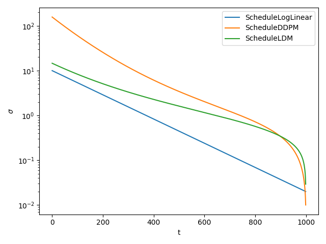
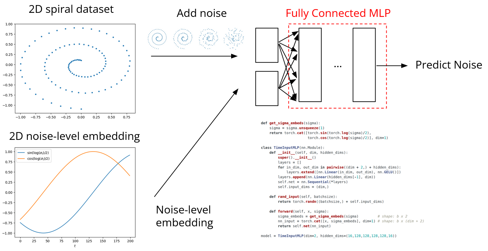
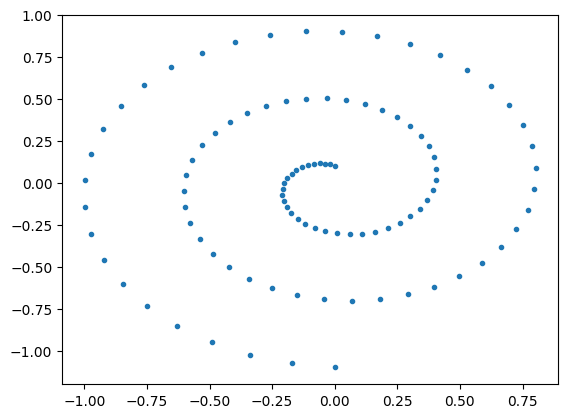
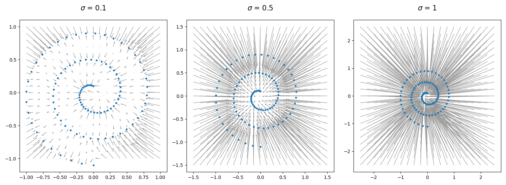
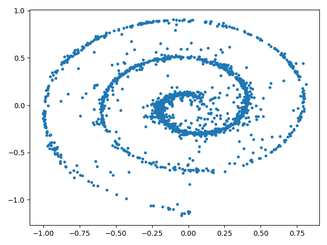
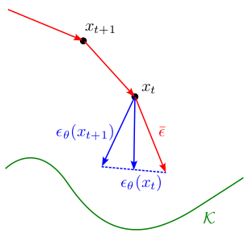
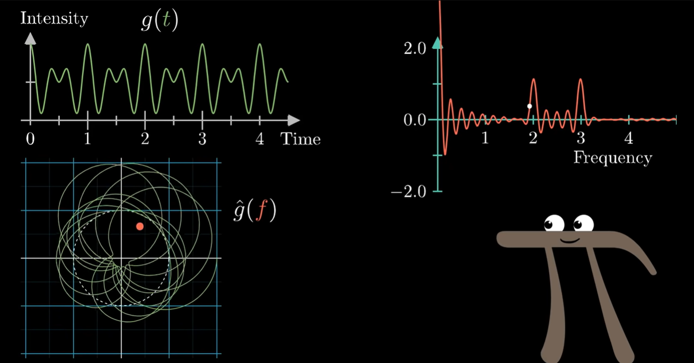

## Diffusion Models
[https://chenyang.co/diffusion.html]
### What is a Diffusion Model?

Background/Terminology:
- noise vector $\epsilon \in \mathbb{R}^n$
- noise level $\sigma>0$
- clean image $x_0$
- noisy image $x_\sigma = x_0 + \sigma \epsilon$
- data manifold $\mathcal{K}$ (space of clean images/unaltered dataset)

Train a supervised learning model $\epsilon_\theta$ (whose inputs are $x_\sigma$, the noisy image, and $\sigma$, and who tries to predict $\epsilon$; we call the parameters of the network $\theta$) to minimize squared norm loss between the predicted $\epsilon$ and the actual $\epsilon$:
$$\min_\epsilon L(\theta) := \mathbb{E} || \epsilon_\theta(x_\sigma, \sigma) - \epsilon ||^2$$
Where:
- $x_\sigma$ is a noisy image from which we want to extract the noise vector (and therefore, also the clean image)
- $\sigma$ sampled from the training noise schedule (discussed below)
- $\epsilon$ sampled from $N(0, I_n)$ 

The idea is that $\sigma$ is a given value; if you can predict $\epsilon$, then you can recover the un-noisy image $x_0$ from the noisy image $x_\sigma$ using $x_\sigma = x_0 + \sigma \epsilon$. This is a more numerically efficient + stable method than predicting the un-noisy image directly.

Noise Schedule:
- discrete set of noise levels (usually 100-1000), sampled uniformly
- Vary widely; usually depicted on log scale:




Common noise schedules include a log-linear schedule, `ScheduleDDPM` (often used in image/pixel-space diffusion models), `ScheduleLDM` (often used in latent diffusion models (models trained on latent space; i.e. have an autoencoder and decoder to shrink the data space)).

Implementation of generic noise schedule + Log Linear schedule:

```python
class Schedule:
    def __init__(self, sigmas: torch.FloatTensor):
        self.sigmas = sigmas
    def __getitem__(self, i) -> torch.FloatTensor:
        return self.sigmas[i]
    def __len__(self) -> int:
        return len(self.sigmas)
    def sample_batch(self, x0:torch.FloatTensor) -> torch.FloatTensor:
        """
        x0 is a batch of data samples, with first dimension of x0 being the batch size.

        returns tensor of size (x0.shape[0],) containing random values from self.sigmas.
        """
        return self.sigmas[torch.randint(len(self), (x0.shape[0],))].to(x0)

class ScheduleLogLinear(Schedule):
    def __init__(self, N: int, sigma_min: float=0.02, sigma_max: float=10):
        super().__init__(torch.logspace(math.log10(sigma_min), math.log10(sigma_max), N))

```

### Training a Diffusion Model

In the simplest case, your diffusion model can just be a multi-layer deep NN. As input, it takes an "image" with added noise, and the noise level sample. It outputs the noise vector.

<center></center>
![[ReadingNotesSupplements/DiffusionToyModel.png]]

Then, the training data consists of $N$ sets of (clean image, noisy image, noise level, noise vector).

Basic training loop:
```python
def generate_train_sample(x0: torch.FloatTensor, schedule: Schedule):
    """Generate noise vector and noise level"""
    sigma = schedule.sample_batch(x0)
    eps = torch.randn_like(x0)
    return sigma, eps

def training_loop(loader  : DataLoader,
                  model   : nn.Module,
                  schedule: Schedule,
                  epochs  : int = 10000):
    optimizer = torch.optim.Adam(model.parameters())
    for _ in range(epochs):
        for x0 in loader:  # iterate through clean images
            optimizer.zero_grad()
            sigma, eps = generate_train_sample(x0, schedule)
            eps_hat = model(x0 + sigma * eps, sigma)
            loss = nn.MSELoss()(eps_hat, eps)
            optimizer.backward(loss)
            optimizer.step()

```

Consider a toy example of trying to train a diffusion model to produce swill rolls:

<center></center>


This dataset contains 2D points; each point is like a "clean image"; the goal of the diffusion model will be to take arbitrary points and denoise them to produce the closest point that is on the spiral.

We parameterize our diffusion model as a multi-layer NN:
```python
def get_sigma_embeds(sigma):
    """Embed sigma into higher dimensional space"""
    sigma = sigma.unsqueeze(1)
    return torch.cat([torch.sin(torch.log(sigma)/2),
                      torch.cos(torch.log(sigma)/2)], dim=1)

class TimeInputMLP(nn.Module):
    def __init__(self, dim, hidden_dims):
        """
        dims = output dimensions
        hidden_dims = tuple of hidden layer sizes
        """
        super().__init__()
        layers = []
        for in_dim, out_dim in pairwise((dim + 2,) + hidden_dims):
            layers.extend([nn.Linear(in_dim, out_dim), nn.GELU()])
        layers.append(nn.Linear(hidden_dims[-1], dim))
        self.net = nn.Sequential(*layers)
        self.input_dims = (dim,)

    def rand_input(self, batchsize):
        """ Generate random noisy input image"""
        return torch.randn((batchsize,) + self.input_dims)

    def forward(self, x, sigma):
        sigma_embeds = get_sigma_embeds(sigma)         # shape: batchsize x 2
        nn_input = torch.cat([x, sigma_embeds], dim=1) # shape: batchsize x (dim + 2)
        return self.net(nn_input)

model = TimeInputMLP(dim=2, hidden_dims=(16,128,128,128,128,16))

schedule = ScheduleLogLinear(N=200, sigma_min=0.005, sigma_max=10)
trainer  = training_loop(loader, model, schedule, epochs=15000)
losses   = [ns.loss.item() for ns in trainer]
```

What is the "$\sigma$ embedding"? Typically, instead of taking the scalar $\sigma$ value directly as input, NN's embed $\sigma$ into a higher dimension using `log` and `sin` and `cos` before feeding as input to the model. This is beneficial because (personally, I find these explanations handwavy) -- 1: $\sigma$ might range from 0.01 to 100 (a large range), so it's numerically beneficial to bound it (this is what the `log` does). Then, it's beneficial to map $\sigma$ from a linear structure onto a circle using sines and cosines; this is inspired by "positional encodings" in Transformer models, it makes $\sigma$ cyclic, potentially helping the model see similarities in different noise levels.

The results of the diffusion model, plotted as a vector field (of $\epsilon$) look like this:

<center></center>
![[ReadingNotesSupplements/DiffusionSwissRollResults.png]]

One might observe an interesting phenomena; for small $\sigma$, the $\epsilon$ vectors point clearly to the nearest point in $\mathcal{K}$. But, for larger $\sigma$, the $\epsilon$ vectors appear to just point to the origin; the mean of all the data. This is explained at the bottom of the *Analytically Ideal Denoiser* section. 

### Analytically Ideal Denoiser

Actually... training a diffusion model is not technically necessary. For the loss function $\min_\epsilon L(\theta) := \mathbb{E} || \epsilon_\theta(x_\sigma, \sigma) - \epsilon ||^2$, there's an analytical solution for $\epsilon(x_\sigma, \sigma)$ (assuming $\mathcal{K}$ is a finite set of discrete samples):
$$\epsilon^*(x_\sigma, \sigma) = \frac{\sum_{x_0 \in \mathcal{K}} (x_\sigma - x_0) \exp(-\|x_\sigma - x_0\|^2 / 2\sigma^2)}{\sigma \sum_{x_0 \in \mathcal{K}} \exp(-\|x_\sigma - x_0\|^2 / 2\sigma^2)}$$
Of course, the reason this isn't used in practice is because it's way too computationally expensive to compute this expression for large datasets; instead, a large neural network is actually a smaller computation. 

Let's look at what this analytically ideal denoiser is doing though. The numerator is a weighted average of all $x_\sigma - x_0 = \sigma \epsilon$ (recall that $x_\sigma = x_0 + \sigma \epsilon \; \rightarrow \;x_\sigma - x_0 = \sigma \epsilon$), with weights equal to $\exp(-\|x_\sigma - x_0\|^2 / 2\sigma^2)$ (a Gaussian centered at $x_0$). The denominator provides a scaling factor that normalizes the weights and divides out the $\sigma$ from the numerator. The intuition is this: smaller errors $x_\sigma - x_0$ get a higher weighting; so this ideal denoiser takes a weighted average of all clean images in the dataset, giving more weight to those that are closer to the noisy image.

The way this ideal denoiser is derived is simple; our loss function is $\min_\epsilon L(\theta) := \mathbb{E} || \epsilon_\theta(x_\sigma, \sigma) - \epsilon ||^2$, therefore the ideal denoiser is $\epsilon^*(x_\sigma, \sigma) = \mathbb{E}[\epsilon | x_\sigma, \sigma]$. Then, simply expand.

Here's why, for large $\sigma$, the resulting $\epsilon$ vectors appear to simply point to the mean of all the data. When $\sigma$ is large, the Gaussian $\exp(-\|x_\sigma - x_0\|^2 / 2\sigma^2)$ becomes almost flat, and the weighted average becomes basically just an average. This means, for large $\sigma$, the denoiser basically returns a wrong result, and the smaller $\sigma$ is, the more accurate the result will be.

### Interpreting what Diffusion is Doing

One interpretation of diffusion is as an approximate projection onto the data manifold $\mathcal{K}$, i.e. minimizing the distance from $x$ to $x_0$.

We define a distance function: 
$$\text{dist}_\mathcal{K}(x) := \min\{\|x - x_0 \| : x_0 \in \mathcal{K}\}$$
And a projection function:
$$\text{proj}_\mathcal{K}(x): \{x_0 \in \mathcal{K} : \text{dist}_\mathcal{K}(x)\}$$
We claim, without proof, that $\nabla \frac{1}{2} \text{dist}_\mathcal{K}^2(x, \sigma) = x - \text{proj}_\mathcal{K}(x)$. Therefore, (half) the gradient of the approximate ($\sigma$-smoothed) squared-distance function is approximately the vector between $x$ and the projection of $x$ onto $\mathcal{K}$.

Actually the distance function above is not always differentiable. Therefore, let's instead define our distance function using this other approximate, "$\sigma$-smoothed" squared distance:
$$\text{dist}_{\mathcal{K}}^2(x, \sigma) := \text{softmin}_{x_0 \in \mathcal{K}} \|x_0 - x\|^2 = -\sigma^2 \log \left( \sum_{x_0 \in \mathcal{K}} \exp \left( -\frac{\|x_0 - x\|^2}{2\sigma^2} \right) \right)$$
Of course, the smaller $\sigma$ is, the smaller the "smoothing" is, and the closer this approximate distance function is to the true distance function. (This will be important later -- smaller noise levels lead to more accurate noise vector estimates).

It's been shown that the ideal denoiser for a given $\sigma$ is actually equivalent to (half) the gradient of a $\sigma$-smoothed squared-distance function (which is equivalent to an approximate projection onto $\mathcal{K}$). Therefore, we can claim that $\text{Ideal Denoiser} = \nabla \frac{1}{2} \text{dist}_\mathcal{K}^2(x, \sigma) \approx x - \text{proj}_\mathcal{K}(x)$. This is why Diffusion can be interpreted as an approximate projection onto $\mathcal{K}$.


### Diffusion Model Inference (DDIM Sampling Algorithm)

When using diffusion in the wild, we generally begin with a very noisy image (i.e. very large $\sigma$) and attempt to build a clean image from it. Thus, since $\sigma$ is large, one-step sampling (i.e. just using inferencing from the Model once and taking that $\epsilon$ prediction as the answer) wouldn't work well; it would likely predict very close to the mean of all data samples in $\mathcal{K}$, which isn't very useful. Recall -- the ideal denoiser is an approximate projection, and takes us to the edge of the manifold $\mathcal{K}$; not to the mean/center of it.

Instead, the strategy is a multi-step inference, beginning at large $\sigma$ and gradually reducing $\sigma$. 

**DDIM Sampling Algorithm**:
1. Begin with $x_T$ (pure noise).
2. At each step $t = T, ..., 1$:
	1. A small $\sigma_t$ is used
	2. The model estimates $\epsilon \approx \nabla_x (\text{dist}_\mathcal{K}^2(x, \sigma_t))$ 
	3. We perform a partial update $x_t \rightarrow x_{t-1}$ by: $x_{t-1} = x_t - (\sigma_t - \sigma_{t-1})\epsilon_\theta(x_t, \sigma_t)$ 

Each step can also be viewed as a *small gradient step* pushing $x_\sigma$ closer to the manifold $\mathcal{K}$ (i.e. gradient descent on function $f(x) = \frac{1}{2} \text{dist}_\mathcal{K}^2(x)$). 
- Step size is $(\sigma_t - \sigma_{t-1})$
- $\nabla f(x_t)$ is estimated by $\epsilon_\theta(x_t, \sigma_t)$

Critical to the performance of DDIM is the $\sigma_t$ schedule; this affects the sizes and number of steps during inference. **Definition**: "Admissible Schedule" $\{\sigma_t\}_{t=0}^T$ ensures $\frac{1}{\nu}\,\mathrm{dist}_\kappa(x_t) \;\le\; \sqrt{n}\,\sigma_t \;\le\; \nu\,\mathrm{dist}_\kappa(x_t)$ (for constant $\nu \geq 1$ and $0 \leq n < 1$). Intuitively, this requirement is saying that $\sigma_t$ roughly corresponds with how far $x_t$ is from the manifold $\mathcal{K}$ (if you are far, $\sigma_t$ is big, if you are close, $\sigma_t$ is small). A common admissible schedule is a log-linear sequence. **Theorem**: if $\{\sigma_t\}_{t=0}^T$ is an admissible schedule, then DDIM converges.

In practice, we may subsample some values from our noise schedule used during training: (adding a function to the `Schedule` class defined above):

```python
class Schedule:
    ...
    def sample_sigmas(self, steps: int) -> torch.FloatTensor:
	    """
	    subsample `steps` number of sigma values from the noise schedule to be
	    used during DDIM sampling
	    """
        indices = list((len(self) * (1 - np.arange(0, steps)/steps))
                       .round().astype(np.int64) - 1)
        return self[indices + [0]]
```

Implementation of DDIM sampling:

```python
batchsize = 2000
sigmas = schedule.sample_sigmas(20)
xt = model.rand_input(batchsize) * sigmas[0]
for sig, sig_prev in pairwise(sigmas):
    eps = model(xt, sig.to(xt))
    xt -= (sig - sig_prev) * eps
```

With 20-step DDIM, the toy example produces the result:


The more DDIM steps, the better the result (at the cost of computation).

### Improved Sampler with Gradient Estimation

(recent research by Frank Permenter and Chenyang Yuan)

As mentioned above, $\epsilon_\theta(x_t, \sigma_t)$ can be interpreted as an approximation of the gradient of the distance function $\nabla \text{dist}_\mathcal{K}(x)$, but it is not perfectly accurate. This method aims to add some correction.

It is actually very simple; at each step $t$, it re-estimates $\epsilon_\theta$ using a combination of the $\epsilon_\theta$ estimate at $t$ and $t+1$, ***with*** $\gamma=2$:
$$\bar{\epsilon}_t = \gamma \epsilon_\theta(x_t, \sigma_t) + (1-\gamma) \epsilon_\theta(x_{t+1}, \sigma_{t+1})$$
A visualization (RECALL THAT $\gamma=2$):



Why? Firstly, this can be interpreted as a "correction" for any error from the last time step ($t+1$). Every time step, as $\sigma$ gets smaller, we expect our estimate of $\epsilon$ to get better. Therefore, at $x_{t}$, we have a better estimate of $\epsilon$ than at $x_{t+1}$, and we know that the estimate of $\epsilon$ at $x_{t+1}$ has at least $\epsilon_\theta(x_t) - \epsilon_\theta(x_{t+1})$ error. Therefore, when computing $\bar{\epsilon}$ at $x_t$, we correct for the error from $x_{t+1}$ by adding: $\bar{\epsilon}_t = \epsilon_\theta(x_t) + (\epsilon_\theta(x_t) - \epsilon_\theta(x_{t+1}))$, which is precisely the $\bar{\epsilon}$ update written above, with $\gamma=2$. (Think about the math -- I don't think the diagram is very informative here.)

Another interpretation of this improved sampler is as adding a "momentum" term, similar to accelerated GD. Recall the interpretation of a DDIM sampling step ($x_{t-1} = x_t - (\sigma_t - \sigma_{t-1})\epsilon_\theta(x_t, \sigma_t)$) as a gradient descent step. Also, recall the algorithm for gradient descent with momentum:
$$\begin{align*}v_{t+1} &= \gamma \nabla f(x) + (1 - \gamma) v_t,\\
x_{t+1} &= x_t - \eta v_{t+1}\end{align*}$$
Then, $v_t$ is analogous to $\bar{\epsilon}_t$ , while $\nabla f(x)$ is analogous to $\epsilon_\theta(x_t, \sigma_t)$. In short this improved sampler is almost perfectly analogous to gradient descent with momentum, with $\gamma=2$. (One note here -- conventional wisdom says that gradient descent with momentum wouldn't converge unless $\gamma \in [0,1]$; however, this accelerated sampling algorithm is different in one key way -- it has reducing step sizes based on the noise schedule, which allows convergence; also recall the theorem earlier about "admissible noise schedules" and convergence guarantees).

### DDPM Sampler

A small modification of DDIM sampling that adds noise during sampling (empirically performs better; "explores distribution more"). To do this, it denoises to a smaller $\sigma_{t'} < \sigma_{t-1}$ at each step, and then adds back noise $w_t \sim N(0,I)$. To be clear: $\sigma_{t'} < \sigma_{t-1} < \sigma_t$.

While the original DDIM sampling scheme looks like:
$$x_{t-1} = x_t - (\sigma_t - \sigma_{t-1})\epsilon_\theta(x_t, \sigma_t)$$DDPM sampling looks like:
$$x_{t-1} = x_t - (\sigma_t - \sigma_{t'})\epsilon_\theta(x_t, \sigma_t) + \eta w_t$$
where $\eta = \sqrt{\sigma_{t-1}^2 - \sigma_{t'}^2}$. Critical to DDPM is how to set $\sigma_{t'}$:
$$\sigma_{t-1} = \sigma_t^\mu \sigma_{t'}^{1-\mu}$$
- if $\mu=0$: $\sigma_{t-1} = \sigma_t \rightarrow$ DDIM sampling
- If $\mu=\frac{1}{2}$: $\sigma_{t-1} = \sqrt{\sigma_t \sigma_{t'}}$ (Geometric mean of $\sigma_t$ and $\sigma_{t'}$) $\rightarrow$  DDPM sampling

The reason we set $\sigma_{t'}$ this way is that it allows us to approximately balance the contribution of the  deterministic sampling with the contribution of the added noise in the update vector $x_{t-1} - x_t$ (this, empirically, is a good thing to do): $\mathbb{E}\left[\|\eta w_t\|^2\right] \approx \mathbb{E}\left[\|(\sigma_t - \sigma_t') \epsilon_\theta(x_t, \sigma_t)\|^2\right]$. There's a complex derivation in Chenyang's paper.

Derivation of $\eta$: we want $x_{t-1}$ to end up with a variance equal to $\sigma_{t-1}^2$ to follow our sampling noise schedule. Realize that $x_t - (\sigma_t - \sigma_{t'})\epsilon_\theta(x_t, \sigma_t) = x_{t'}$ has variance $\sigma_{t'}$; also, $\eta \omega_t$ has a variance $\eta$. 

$x_{t-1} = x_t - (\sigma_t - \sigma_{t'})\epsilon_\theta(x_t, \sigma_t) + \eta w_t \implies x_{t-1} = x_{t'} + \eta \omega_t$. Therefore, $\text{Var}(x_{t-1}) = \text{Var}(x_{t'}) + \text{Var}(\eta \omega_t)$. Plugging in the variances explained in the paragraph above, we get: $\sigma_{t-1}^2 = \sigma_{t'}^2 + \eta^2 \implies \eta = \sqrt{\sigma_{t-1}^2 - \sigma_{t'}^2}$.

#### Common Diffusion Model Architectures

A multi-layer NN is not enough for advanced data modalities. Here, we outline 2 common alternative architectures used.

**Convolutional U-Nets**:
- General idea: Encoder and Decoder blocks; encoder decreases dimension of the data while increasing # channels; decoder does the reverse

**Patch-wise Transformers**
- Break image into grid of patches; input patches into NN that creates patch embeddings

## Interpretations of Diffusion
[https://lilianweng.github.io/posts/2021-07-11-diffusion-models/]
#### Probabilistic Interpretation: 

Define data sample from data distribution $x_0 \sim q(x)$.

Forward diffusion = adding Gaussian noise in $T$ steps, producing sequence of noisy samples $x_1, ..., x_T$, with variance schedule $\{\beta_t \in (0,1)\}_{t=1}^T$:
$$\begin{align*}q(x_t | x_{t-1}) &= \mathcal{N}(x_t; \sqrt{1-\beta_t} x_{t-1}, \beta_t \mathbf{I}) \\ q(x_1, ..., x_T | x_0) &= \prod_{t=1}^T q(x_t | x_{t-1}) \end{align*}$$
The first line says that each step $t$ involves sampling $x_t$ from a Gaussian centered at $\sqrt{1-\beta_t} x_{t-1}$, with variance $\beta_t \mathbf{I}$. Clearly, $\beta_t$ controls the amount of added noise versus re-use of the image at the previous step. The second line simply exemplifies the Markov Chain (each state $x_t$ only depends on previous state $x_{t-1}$) nature of the forward diffusion process.

Note: $\beta_t \leftrightarrow \sigma_t^2$ (to draw a connection to the prior interpretation based on Chenyang Yuan's work). $\beta_t$ is a variance; $\sigma_t$ is a standard deviation. 

We can rewrite these equations so that can compute $x_t$ at any $t$ in closed form, without needing to recurse from $x_0$ (define $\alpha_t = 1 - \beta_t$ and $\bar{\alpha}_t = \prod_{i=1}^t \alpha_i$): 

$$\begin{align*}
x_t &= \sqrt{\alpha_t} x_{t-1} + \sqrt{1 - \alpha_t} \epsilon_{t-1} & \text{where } \epsilon_{t-1}, \epsilon_{t-2}, \dots \sim \mathcal{N}(0, \mathbf{I}), \\  &= \sqrt{\alpha_t \alpha_{t-1}} x_{t-2} + \sqrt{1 - \alpha_t \alpha_{t-1}} \epsilon_{t-2} & \text{where } \epsilon_{t-2} \text{ merges two Gaussians (*)} \\ &= \dots \\
   &= \sqrt{\bar{\alpha}_t} x_0 + \sqrt{1 - \bar{\alpha}_t} \epsilon, \\ 
q(x_t|x_0) &= \mathcal{N}(x_t; \sqrt{\bar{\alpha}_t} x_0, (1 - \bar{\alpha}_t) \mathbf{I}).
\end{align*}$$

We can clearly see that this interpretation is the same as above: 
$$x_t = \sqrt{\bar{\alpha}_t} x_0 + \sqrt{1 - \bar{\alpha}_t} \epsilon \quad \leftrightarrow \quad x_\sigma = x_0 + \sigma \epsilon$$


### SDE (Stochastic Diff Eq) Interpretation

### ODE (Ordinary Diff Eq) Interpretation

### Flow Models

### Diffusion Models as Autoregressive Models


## Conditional Diffusion

Above, we've discussed unconditional diffusion; you start from noise, and the diffusion model denoises to the closest image in the dataset. What if your image dataset is super diverse? What if you want to condition on some text prompt? Therefore, for large diffusion models, conditional diffusion is a necessity. 

Consider a simple example: a dataset of images of dogs/cats. An unconditional diffusion model has no way to select between outputting a dog or car. A conditional diffusion model, conditioned on a label that takes value either "dog" or "cat", can.

Consider your image $x$ and condition/label $y$. Unconditional diffusion learns the clean data distribution $p(x)$; the goal of conditional diffusion is to predict $p(x|y)$.

**The dumb way**: Train your diffusion model to take in both the noisy image and a condition as input and output the clean image. This works... for low-dimensional problems.

### Classifier Guidance

**Guidance**: Only train the model to denoise $x_T$ to $x_0$; only include the condition at sampling time.

**Classifier**: The given condition is a class label (i.e. "cat", "dog").

Let's begin by simplifying the expression $p(x|y)$:
$$\begin{align*} p(x \mid y) &= \frac{p(y \mid x) \cdot p(x)}{p(y)} \\
\implies \log p(x \mid y) &= \log p(y \mid x) + \log p(x) - \log p(y) \\
\implies \nabla_x \log p(x \mid y) &= \nabla_x \log p(y \mid x) + \nabla_x \log p(x), \end{align*}$$
We apply Bayes' Rule, take the $log$, then take the gradient wrt $x$.

This final equation is useful, because we want to know $\nabla_x \log p(x|y)$, and we already know $\nabla_x \log p(x)$ from training the unconditional diffusion model; we just need to figure out how to compute $\nabla_x \log p(y|x)$.

Intuitively, $p(y|x)$ can be approximated by a classifier; it takes an image $x$ and outputs a label/condition $y$ (although $x$ may be noisy during intermediate sampling steps). Therefore, all we have to do is train a good classifier of these images. There is one complexity -- at earlier steps in the diffusion process, $x$ will be very noisy, so we have to train a classifier that is robust to this noise.

**Empirical Hack**: Often, people insert a constant $s>1$ before $\nabla_x \log p(y \mid x)$ called a "guidance strength". This just biases the distribution $\nabla_x \log p(x \mid y)$ further toward the conditional term $\nabla_x \log p(y \mid x)$; it seems to make the effect of the conditioning stronger. 
$$\nabla_x \log p(x \mid y) = s \nabla_x \log p(y \mid x) + \nabla_x \log p(x)$$
Guidance does add an inherent bias (i.e. the $\log p(y \mid x)$ term). Technically, if the classifier were trained on the same training data as the diffusion model and it were perfect, then it would perfectly output $p(y|x)$, and there would be no bias. But the classifier is only an approximation of $p(y|x)$ and contain biases. Therefore, the sampler can output images not-in-distribution. Normally, this is fine/this is what we want, but good to be aware of it.

### Classifier-free Guidance

Guidance but allowing more free-form conditions (i.e. text prompt), not necessarily a class label.


<br /><hr /><br />


## Fourier Transform

Credits: [https://www.youtube.com/watch?v=spUNpyF58BY]

Purpose: Broadly, decomposes a wave function into a combination of sine waves. Technically, it takes an arbitrary wave function $g(t)$ and transforms it into a new function $\hat{g}(f)$ that contains spikes at the generating sine wave frequencies.

The new function $\hat{g}(f)$ takes frequency as an input (and outputs an complex number that is the "intensity" at each frequency):

$$ \hat{g}(f) =\int_{t_1}^{t_2} g(t) e^{-2 \pi i ft} dt $$

Intuitively, this is what the function is doing:
- First, it takes $e^{-2 \pi i ft}$, which corresponds to some point on the unit circle in the complex plane. Recall that $e^{it}$ = $\text{cos}(t) + i ~\text{sin}(t)$, so increasing $t$ from $0$ to $2\pi$ is like walking around the edge of a unit circle. Then, the input $f$ controls the rate we travel around the unit circle.
- Multiplying $e^{-2 \pi i ft}$ by $g(t)$ effectively applies $g(t)$ onto that unit circle; it's like wrapping the wave function on the circle.
- Taking the integral is effectively taking the "average" of all the points in the complex plane (the red dot in the bottom left graph). "Average" in quotations because it is more of a sum than an average (it's not divided by $(t_2 - t_1)$), but this just has the effect of scaling $\hat{g}(f)$ up for longer wave signals.
- Taking the real part of the output (i.e. the x-coordinate of the red dot), we find that it spikes around the frequencies of the sine waves constructing $g(t)$ (see the spikes on the top right graph).

