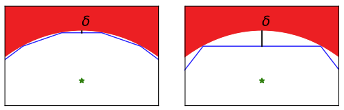
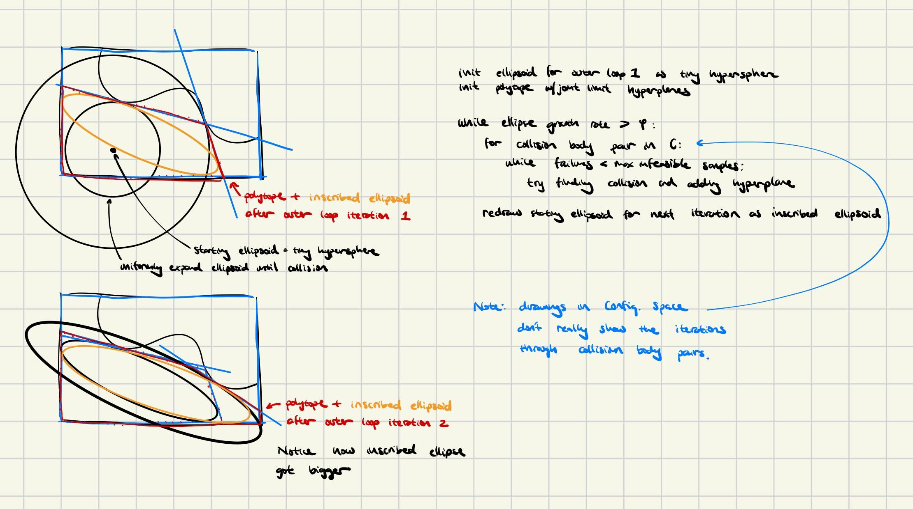

## (IRIS-NP:) [Growing Convex Collision-Free Regions in Configuration Space using Nonlinear Programming](https://arxiv.org/pdf/2303.14737.pdf) - 1/12/2024
### Method
- Assumptions: known collision geometries (in task-space).
- Goal: generate convex polytope w/max volume inscribed ellipsoid
   - Note: calculating volume of polytope itself is NP-hard → ellipsoid as a heuristic.
#### Generating 1 ellipsoid:
- Ellipsoid expressed like so: $ \epsilon(C,d) = {x | (x-d)^T C^T C(x-d) \leq 1}) $.
- Polytope expresed as collections of "halfplanes": $ P(A,b) = \{x|Ax \leq b\} $
- Initialization: seed $q_0$; $P_0$ is initialized w/robot joint limits. $\epsilon_0$ initialized as tiny hyperphere.
- Adding Separating Hyperplanes: Iterate over all pairs of collision bodies. For each pair of collision bodies, repeat until "counter-example search" repeatedly fails:
   - search for configurations within polytope resulting in collision ("counter-example search"). Add plane tangent to the ellipsoid at any collision point.
   - "counter-example search": Technically, solves (non-linear) optimization for nearest point to ellipsoid center that results in collision between two given collision bodies (performs forward kinematics to detect the collision in task-space $\rightarrow$ non-linearity). Can be geometrically understood as uniformly expanding ellipsoid until collision detected.
   - if obstacles are convex in config. space (usually not the case unless you pre-decompose non-convex obstacles into convex parts), then tangent hyperplane guaranteed to separate collision from non-collision.
   - if obstacles non-convex in config. space, back the hyperplane away by user-defined margin $\delta$.
      - 
      - makes hyperplane extra conservative, but ensures finite number of hyperplanes can guarantee the convex set is out of collision.
   - If "counter-example search" fails multiple times, break and move onto next collision pair (probably no more collisions in convex set; this is not guaranteed bc the "counter-example search" is a non-linear optimization $\rightarrow$ not guaranteed to find all solutions).
- Analytically calculate volume of inscribed ellipse.
- Repeat until ellipse growth rate too low.

 

- Speed Optimizations:
   - Sorting collision bodies: considering closest collision bodies first is better bc the closer hyperplane may separate further obstacles $\rightarrow$ fewer hyperplanes needed overall. Therefore, for each seed $q_0$, first consider collision bodies with closest task-space distance. This is a heuristic for the collision body distance in config. space.

#### Decomposing the entire config. space

The goal for a single polytope = maximize volume; but, if we have multiple polytope all maximizing volume, they'll end up ignoring small crevices or smaller areas. As a heuristic to encourage expnsion, each time an polytope is generated, treat it as an obstacle when generating the next polytope.

#### Region Refinement

Note: works only with the introduction of new obstacles, not the removal of existing obstacles.

Keep original regions. When new obstacle is introduced, start with some seed (can be either the already-generated ellipsoid for a nearby region or a new hypersphere at a new nearby $q_0$); perform just one round (i.e. only 1 iteration of the outer `while` loop in the graphic above) of adding hyperplanes, considering only collision pairs between the new obstacle and all other collision bodies.

  

## [Motion Planning around Obstacles with Convex Optimization](https://arxiv.org/pdf/2205.04422.pdf) - 1/12/2024
### Background
- Traj. Opt. is optimal, but low in high dimensions, many obstacles (many non-convexities)
- Advantages of GCS:
   - takes advantage of sampling & optimization to achieve global optimality quickly in clutter & high dimensions
   - works with differential constraints (i.e. velocity/acceleration) (sampling algorithms have trouble with this due to discreet samples)

